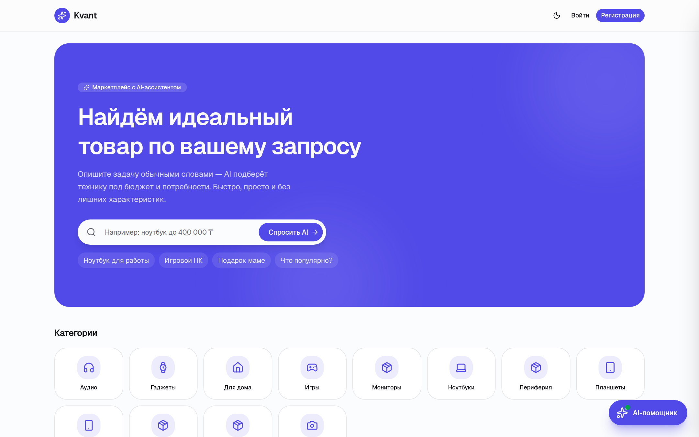
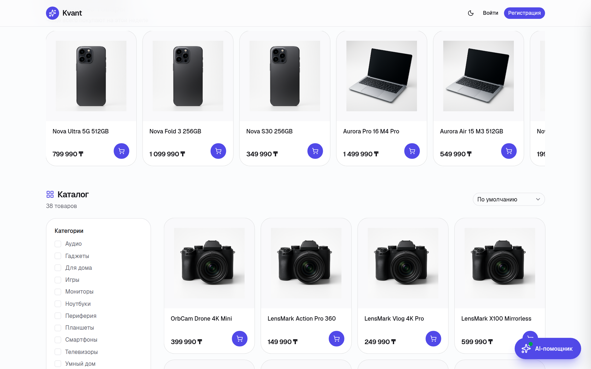

<h1 align="center">
  <br>
  ⚡ Kvant
  <br>
</h1>

<h4 align="center">Интернет-магазин с AI-ассистентом на базе семантического поиска</h4>

<p align="center">
  
  
  
  
  
  
</p>

<p align="center">
  <a href="#возможности">Возможности</a> •
  <a href="#стек">Стек</a> •
  <a href="#архитектура">Архитектура</a> •
  <a href="#быстрый-старт">Быстрый старт</a> •
  <a href="#разработка">Разработка</a>
</p>

<p align="center">
  
</p>

<p align="center">
  
</p>

---

## Возможности

- **AI-ассистент** — чат-бот с RAG (Retrieval-Augmented Generation): понимает запросы на естественном языке, ищет товары по смыслу через OpenAI Embeddings + pgvector
- **Каталог товаров** — фильтрация по категориям, брендам, цене; карточки с профессиональными фотографиями на белом фоне
- **Корзина** — добавление товаров, изменение количества, snapshot цены на момент добавления
- **Оформление заказа** — экран обработки → анимированный экран успеха с подтверждением оплаты
- **История заказов** — просмотр заказа с фотографиями товаров, статус доставки, отмена
- **Аутентификация** — JWT + refresh tokens, RBAC с пермишенами, одна сессия на аккаунт
- **Тёмная/светлая тема** — переключение на лету

---

## Стек

### Frontend
| Технология | Версия | Назначение |
|---|---|---|
| Next.js | 15 (App Router) | SSR / CSR фреймворк |
| TypeScript | 5 | Типизация |
| Tailwind CSS | 4 | Стили |
| shadcn/ui | latest | UI-компоненты |
| Lucide React | latest | Иконки |

### Backend (микросервисы)
| Сервис | Порт | Технологии |
|---|---|---|
| auth_service | 8000 | FastAPI, SQLAlchemy, bcrypt, JWT |
| user_service | 8001 | FastAPI, SQLAlchemy |
| product_service | 8002 | FastAPI, SQLAlchemy |
| cart_service | 8003 | FastAPI, SQLAlchemy, httpx |
| order_service | 8004 | FastAPI, SQLAlchemy, httpx |
| payment_service | 8005 | FastAPI, SQLAlchemy |
| chat_service | 8006 | FastAPI, OpenAI, pgvector |

### Инфраструктура
| Компонент | Назначение |
|---|---|
| PostgreSQL 16 | Основная БД (отдельная БД на каждый сервис) |
| Redis 7 | Кэш пермишенов, сессии |
| Nginx | Reverse proxy / маршрутизация |
| Docker Compose | Оркестрация |
| Alembic | Миграции БД |
| Dishka | Dependency Injection (IoC) |

---

## Архитектура

```
┌─────────────────────────────────────────────────────────┐
│                        Браузер                          │
│                    Next.js Frontend                     │
└────────────────────────┬────────────────────────────────┘
                         │ HTTP
                    ┌────▼─────┐
                    │  Nginx   │  :80
                    └────┬─────┘
         ┌───────────────┼───────────────┐
         │               │               │
    ┌────▼────┐    ┌─────▼─────┐   ┌────▼────┐
    │  auth   │    │  product  │   │  cart   │
    │ :8000   │    │  :8002    │   │  :8003  │
    └────┬────┘    └─────┬─────┘   └────┬────┘
         │               │               │ httpx
    ┌────▼────┐    ┌─────▼─────┐   ┌────▼────┐
    │  user   │    │   chat    │   │  order  │
    │ :8001   │    │  :8006    │   │  :8004  │
    └─────────┘    └───────────┘   └────┬────┘
                                        │ httpx
                                   ┌────▼────┐
                                   │ payment │
                                   │  :8005  │
                                   └─────────┘
         │               │               │
    ┌────▼───────────────▼───────────────▼────┐
    │          PostgreSQL + Redis              │
    └──────────────────────────────────────────┘
```

**Связь между сервисами:**
- Пермишены читаются из Redis без HTTP-запросов к auth_service
- cart_service вызывает product_service для получения актуальной цены
- order_service вызывает cart_service (получить корзину, очистить после заказа) и product_service (snapshot имени товара)
- payment_service вызывает order_service для проверки заказа и отправки уведомлений

---

## Быстрый старт

### Требования
- Docker Desktop
- OpenAI API key (для AI-ассистента)

### 1. Клонировать репозиторий

```bash
git clone https://github.com/yourusername/ai-shop-assistant.git
cd ai-shop-assistant
```

### 2. Создать `.env` в корне

```env
# База данных
POSTGRES_USER=postgres
POSTGRES_PASSWORD=postgres

# JWT (одинаковый во всех сервисах)
AUTH_SECRET_KEY=your-super-secret-key-change-this

# Redis
REDIS_URL=redis://redis:6379

# OpenAI (для AI-ассистента)
OPENAI_API_KEY=sk-...
```

### 3. Запустить

```bash
docker compose up --build
```

Первый запуск займёт 2–3 минуты: поднимутся все сервисы, применятся миграции, сидируются роли.

### 4. Создать администратора

```bash
make docker-create-admin
```

### 5. Проиндексировать товары в AI-ассистент

```bash
docker compose exec chat_service python -c "
import asyncio
async def run():
    from app.factory import create_app
    from app.application.service.rag_service import RAGService
    app = create_app()
    async with app.state.dishka_container() as c:
        count = await (await c.get(RAGService)).index_all_products()
        print(f'Indexed {count} products')
asyncio.run(run())
"
```

Открыть **http://localhost** 🎉

---

## Разработка

### Структура `.env` файлов

| Файл | Для чего |
|---|---|
| `.env` (корень) | Docker Compose переменные |
| `service/auth_service/.env` | Локальная разработка auth (DB_HOST=localhost) |
| `service/user_service/.env` | Локальная разработка user |
| `service/product_service/.env` | Локальная разработка product |
| `service/cart_service/.env` | + PRODUCT_SERVICE_URL=http://localhost:8002 |
| `service/order_service/.env` | + CART_SERVICE_URL, PRODUCT_SERVICE_URL |
| `service/payment_service/.env` | + ORDER_SERVICE_URL=http://localhost:8004 |

### Команды Makefile

```bash
# Запуск сервисов локально (без Docker)
make dev              # auth_service  :8000
make user-dev         # user_service  :8001
make product-dev      # product_service :8002
make cart-dev         # cart_service  :8003
make order-dev        # order_service :8004
make payment-dev      # payment_service :8005

# Тесты
make test             # auth
make user-test        # user
make product-test     # product
make cart-test        # cart
make order-test       # order

# Миграции
make migrate          # auth
make user-migrate     # user
make product-migrate  # product
# ...аналогично для остальных

# БД
make seed             # сидировать роли и пермишены
make init-db          # migrate + seed

# Docker
make docker-init-db   # migrate + seed в Docker
make docker-create-admin
```

### Nginx маршрутизация

| Путь | Сервис |
|---|---|
| `/api/v1/users/*` | user_service:8001 |
| `/api/v1/products/*` | product_service:8002 |
| `/api/v1/categories/*` | product_service:8002 |
| `/api/v1/brands/*` | product_service:8002 |
| `/api/v1/cart/*` | cart_service:8003 |
| `/api/v1/orders/*` | order_service:8004 |
| `/api/v1/payments/*` | payment_service:8005 |
| `/api/v1/webhooks/*` | payment_service:8005 |
| `/api/v1/chat/*` | chat_service:8006 |
| `/*` | auth_service:8000 |

### RBAC

```
users → user_roles → roles → role_permissions → permissions
```

При логине: пермишены из PostgreSQL → кэш Redis с TTL = время жизни access-токена. Каждый запрос читает из Redis (~1ms).

Добавить новый пермишен:
1. `app/domain/permissions.py` → класс `P`
2. `app/cli/seed.py` → `ROLE_PERMISSIONS`
3. В роуте: `dependencies=[Depends(require_permission(P.NEW_PERM))]`

### Тесты

Каждый сервис содержит 4 уровня тестов:

```
tests/
├── unit/         # FakeRepo, FakeCache — без БД
├── integration/  # реальная БД через db_session
├── api/          # httpx ASGITransport
└── e2e/          # полный flow
```

---

## Структура проекта

```
ai-shop-assistant/
├── docker-compose.yml
├── Makefile
├── nginx/
├── postgres/
│   └── init/              # SQL-скрипты создания БД
├── frontend/              # Next.js 15 App Router
│   ├── app/
│   │   ├── page.tsx       # Главная: каталог + AI-поиск
│   │   ├── checkout/      # Оформление заказа
│   │   ├── orders/        # История заказов
│   │   └── auth/          # Логин / Регистрация
│   ├── components/
│   │   ├── cart-provider.tsx
│   │   ├── auth-provider.tsx
│   │   └── ai-chat/       # Чат с AI-ассистентом
│   └── lib/api/           # API-клиенты
└── service/
    ├── auth_service/
    ├── user_service/
    ├── product_service/
    ├── cart_service/
    ├── order_service/
    ├── payment_service/
    └── chat_service/
```

---

